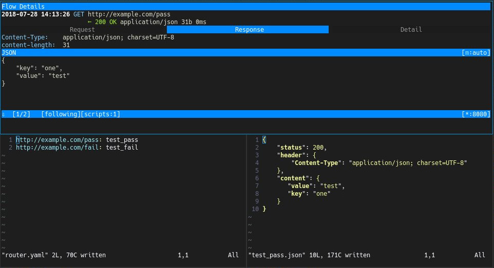

# mitm-script

This is a collection of some handy [mitmproxy](https://github.com/mitmproxy/mitmproxy) inline scripts.

## PRECONDITION:

1. Install [mitmproxy](https://docs.mitmproxy.org/stable/overview-installation/)

2. Client side CA setup: http://docs.mitmproxy.org/en/stable/certinstall.html

---

## mitm-rewrite

The purpose of this script is to return mock JSON response for certain target URLs.

### HOW TO USE:

1. Run mitmdump:
```
~$ mitmdump -s mitm-rewrite.py
```

2. Quick check setup on client side:
- Open http://example.com/pass should return data in test_pass.json
- Open http://example.com/fail should return data in test_fail.json

3. Update `rewrite-router.yaml`, pair URL with JSON file, for e.g:
```
http://example.com: example
```
The response of "http://exmaple.com" will be rewrote by the content
in example.json file. Using yaml file is easy for human to read and
it's possible to add comment in yaml.

4. Add static JSON file, file example:
```
{
  "status": 200,
  "header": { ... },
  "content": ...
}
```

- status: http status code, an INT number
- header: http response headers
- content: response body

The changes in yaml files will be applied **on the fly**, no need to restart proxy. Here is an example how it looks like:



---

## mitm-check-analytics

The usage of this script is to display real-time analytics key and value, in order to help checking analytics efficiently.

To configure URL and keywords, edit `check-analytics.yaml`
It's possible to configure the url and

### HOW TO USE:

1. Run mitmdump:
```
~$ mitmdump -s mitm-check_analytics.py
```

2. Visit target web page in clients: browsers or apps. The matched analytics keyword and value will show up in terminal.

---

## mitm-delay

This script will randomly delay HTTP/HTTPS request time and response time, in order to simulate the slow network.

To configure URL and delay time, edit `delay-request.yaml`

### HOW TO USE:

```
~$ mitmdump -s mitm-delay-request.py
```

---

## mitm-replace

This script will replace the specific string to another one. Like *mitm-rewrite*, a `replace-router.yaml` is used to link URL and yaml file in `response` folder. In the yaml file, the old and new strings can be defined. Don't forget to uncomment URLs in `replace-router.yaml` and make it work on the fly!

### HOW TO USE:

```
~$ mitmdump -s mitm-replace.py
```

---

## mitm-random-outage

This script will simulate sever outage and return 503 code. It will pick randomly the requests to  make it 503. The percentage of outage can be changed as the variable percentage in the script.

### HOW TO USE:

```
~$ mitmproxy -s mitm-random-outage.py
```

---

## mitm-redirect-host & mitm-redirect-url

`mitm-redirect-host` will redirect the request **host** of URL request to another host. The matching URL and redirect host can be defined in `redirect-router.yaml`. Attention: only the host part of request URL will be replaced.

`mitm-redirect-url` will redirect the whole request to another URL. The matching URL and redirect URL can be defined in `redirect-router.yaml`.

### HOW TO USE:

```
~$ mitmproxy -s mitm-redirect-host.py

~$ mitmproxy -s mitm-redirect-url.py
```

---

## mitm-show-header

This script will print out matched request header and response header, with its value. The matching URL and header can be defined in `show-header.yaml`.

### HOW TO USE:

```
~$ mitmdump -s mitm-show-header.py | grep '>>\|->'
```

---

## mitm-dump-curl

This script will find matching request URL and dump the request to a file in as cURL format. The matching URL and dump folder can be defined in `dump-curl.yaml`.

### HOW TO USE:

```
~$ mitmdump -s mitm-dump-curl.py
```

---

## mitm-record

This script will save matching request details (request headers, request body, response headers and response body) to a specific file. The matching URl and dump folder can be defined in `record-request.yaml`.

### HOW TO USE:

```
~$ mitmdump -s mitm-record.py
```
